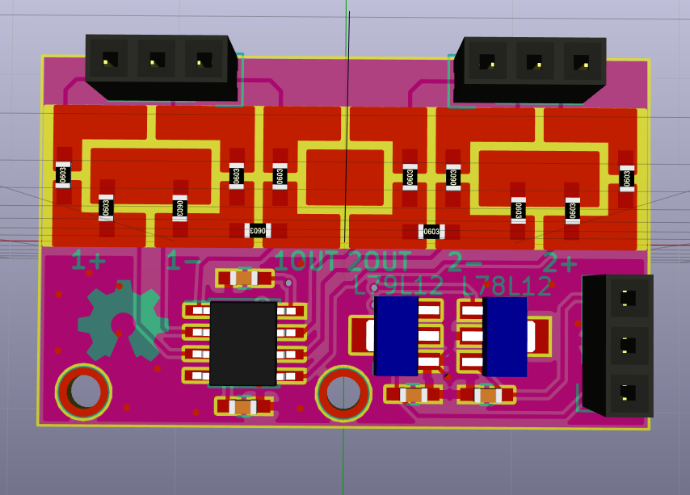

miniboard-opamp
===============

This is a prototyping board for surfece-mount opamps with the most common footprint.
It has a surface-mount prototyping to build all common op-amp filter topologies

Here is what it looks like :

Front

Features :
* A footpint for an SO-8 op-amp
* Local power regulation
* SMD prototyping pads.

The board is made with Kicad and requires a 2015 version for editing (with .pretty footprint libraries support)
